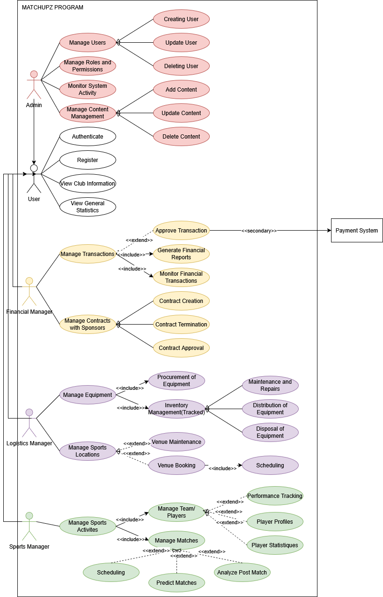

# Gestion MatchUpz

## Overview
Gestion MatchUpz is a comprehensive system designed to manage various roles and functionalities within a sports and logistics application. It includes structured processes for authentication, registration, sponsor management, supplier management, sports facility management, reservations, and more.

## Use Case Diagram
The following **Use Case Diagram** represents the interactions between different actors and their respective functionalities within the system:



## Entity-Class Diagram
Below is the **Entity-Class Diagram**, which showcases the relationships and attributes of various entities within the system:


## Features
- User authentication and registration
- Role-based management for admins, users, and managers
- Sponsor and supplier management
- Sports facility and reservation handling
- Unified structure for seamless integration

## Installation & Setup
1. Clone the repository:
   ```bash
   git clone https://github.com/yourusername/matchupz.git
   ```
2. Navigate to the project directory:
   ```bash
   cd matchupz
   ```
3. Follow the installation instructions for the specific framework/language used.

## Contributing
We welcome contributions! Feel free to fork the repository and submit a pull request with your improvements.

## License
This project is licensed under the MIT License. See the [LICENSE](./LICENSE) file for details.
